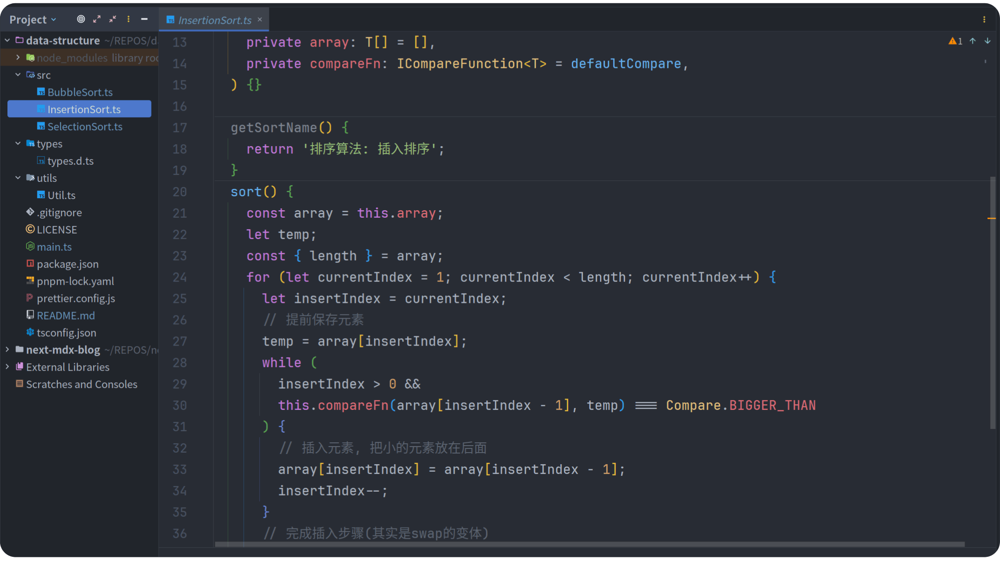

## 数据结构



[//]: # (&#40;图片由TinySnap + pngquang 处理&#41;)

TypeScript + Data Structure

## 为什么使用 TypeScript 呢

每个人都喜欢使用自己擅长的方式写代码,不是吗

## Feature

* 提供数据测试算法
* 使用ts规范代码
* 使用tsx直接运行ts文件
* 使用prettier格式代码
* 分离每一个算法为单个文件
* 使用 pnpm 安装依赖

## Usage

```bash
git clone --depth 1 https://github.com/oeyoews/data-structure.git  # clone repo
pnpm install  # install dependencies
pnpm run dev  # running 入口文件是项目根目录的 main.ts 文件
```

## 排序算法

* 插入排序(3)
  1. [直接插入排序](./src/InsertionSort.ts)
  2. 折半插入排序
  3. 希尔排序
* 交换排序(2)
  1. [冒泡排序](./src/BubbleSort.ts)
  2. [快速排序](./src/QuickSort.ts)
* 选择排序(2)
  1. [简单选择排序](./src/SelectionSort.ts)
  2. 堆排序
* 归并排序
* 基数排序

## TODO

- [ ] 完成十大排序算法
- [ ] 使用prompt自动提示验正那种排序算法
- [ ] 使用 NextJs 构建项目文档网站, 支持在线预览代码

## Editor

使用 webstorm(也支持vscode,neovim,或者你喜欢的任何一款代码编辑器)

## Credits

* https://github.com/likaia/JavaScript-test
* https://juejin.cn/post/6860501233308794887

<small>写于2023/08/27, 此仓库代码仅供学习参考</small>
